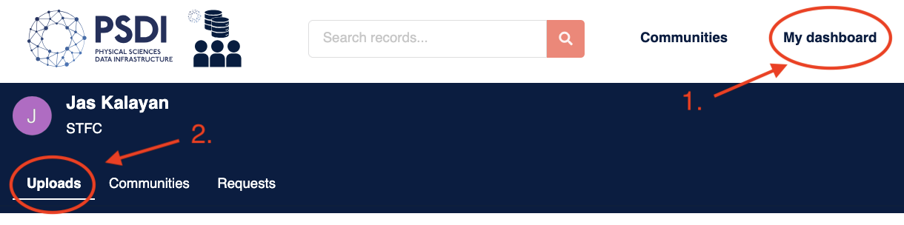
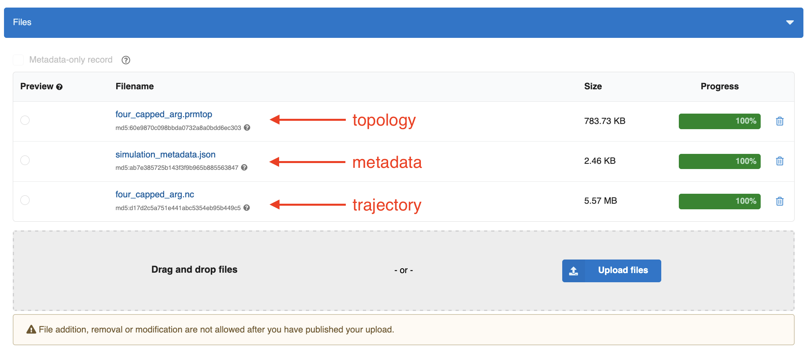
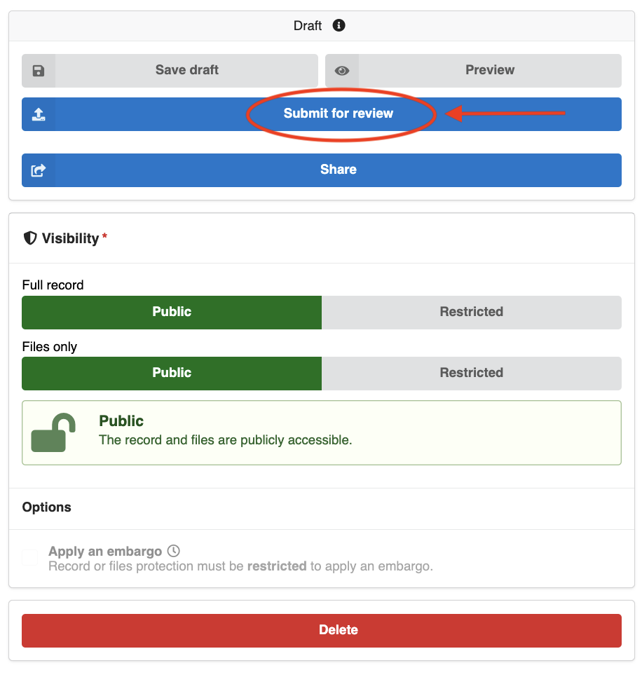
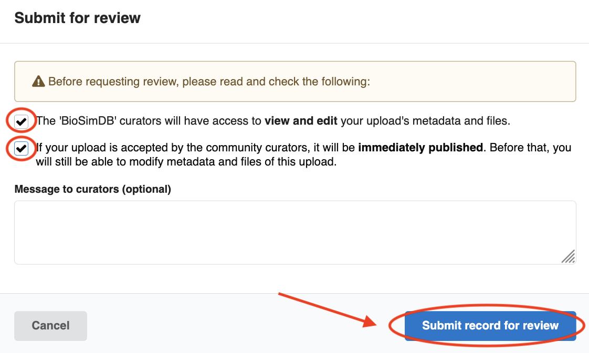

3. Complete BioSimDB Submission
===============================

Once you have submitted a record to BioSimDB via the "BioSim Data Extraction & Submission Form", your
draft submission will be available in `data-collections <https://data-collections.psdi.ac.uk/>`_ in the "My dashboard" section under uploads, in a URL like this: https://data-collections.psdi.ac.uk/uploads/XXXXX-XXXXX, where ``XXXXX-XXXXX`` is your draft record ID.

Make sure you are `logged in <https://data-collections.psdi.ac.uk/login/?next=/>`_  to see your draft uploads.
The next step is to submit your data for review to be published to BioSimDB.

Filling the BioSimDB Submission Form
------------------------------------

You should see the simulation files and metadata uploaded from the "BioSim Data Extraction & Submission Form" form in your draft submission:

.. note::
    Please ensure the ``simulation_metadata.json`` file is included in your record, your data submission will not be accepted without this!

The rest of the form allows users to provide non-technical information about their data submission.

    1. Provide a title describing your simulation contents.
    2. Add creators of the simulation data.
    3. Include a scientific-style abstract for your submission. Here is where you can add the "why", the scientific insights and further context of your data.
    4. If applicable, you can edit the default license set for your data to be more permissive/restrictive, as required for your needs. Please note, a license cannot be made more restrictive once the data is published.

    .. image:: ../_static/biosimdb/2_basic_info.png
        :width: 600
        :align: center

    5. Include contributors who haven't directly produced the data as additional contributors.
    6. This is only required for future changes to your data (e.g. updated metadata, files, status), where you can include a date, type and short description of a change made to the record.

    .. image:: ../_static/biosimdb/3_rec_info.png
        :width: 600
        :align: center

    7. Include information of funding that enabled data to be produced.
    8. If have published your data elsewhere, add identifiers to these here.
    9. Include identifiers of any work that has used the simulation data in your record.

    .. image:: ../_static/biosimdb/4_funding.png
        :width: 600
        :align: center

Once you are happy with the information you have provided, please submit your data record for review.

You will see a pop-up box to confirm your submission and include an optional message to BioSimDB curators.

