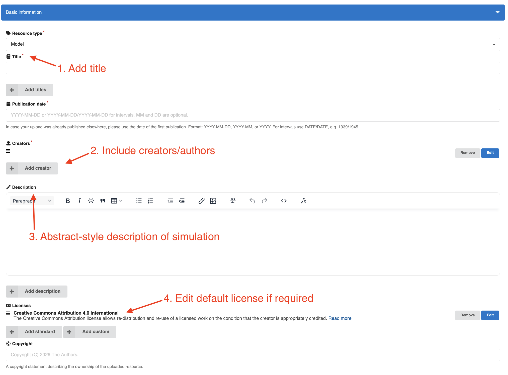
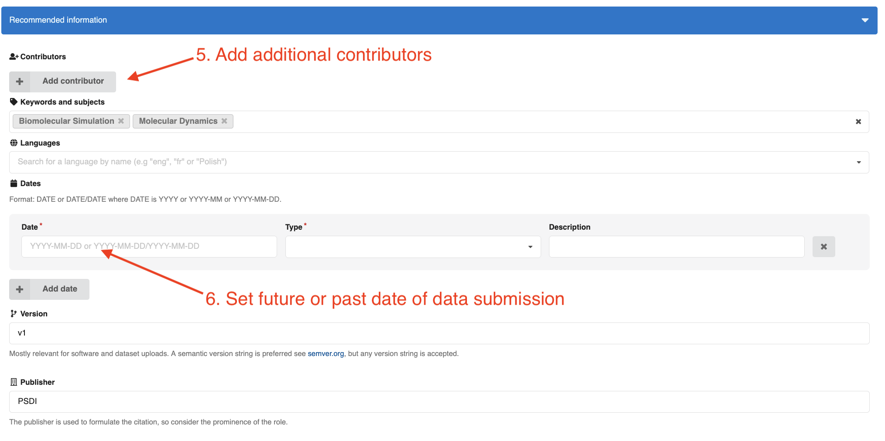
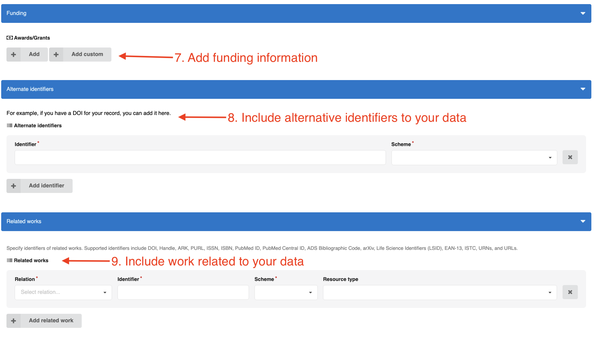

Completing BioSimDB Submission
==============================

Once you have submitted a record to BioSimDB via the "BioSim Data Extraction & Submission Form", your
draft submission will be avaiable in data-collections in the "My dashboard" section under uploads, in a URL like this: https://data-collections.psdi.ac.uk/uploads/XXXXX-XXXXX

.. image:: ../_static/biosimdb/0_uploads.png
   :width: 600
   :align: center

Make sure you are `logged in <https://data-collections.psdi.ac.uk/login/?next=/>`_  to see your draft uploads.

Filling the BioSimDB Submission Form
------------------------------------

You should see the simulation files and metadata uploaded from the "BioSim Data Extraction & Submission Form" form in your draft submission:

.. image:: ../_static/biosimdb/1_files.png
   :width: 600
   :align: center

Next, the

.. image:: ../_static/biosimdb/5_submit.png
   :width: 400
   :align: center
