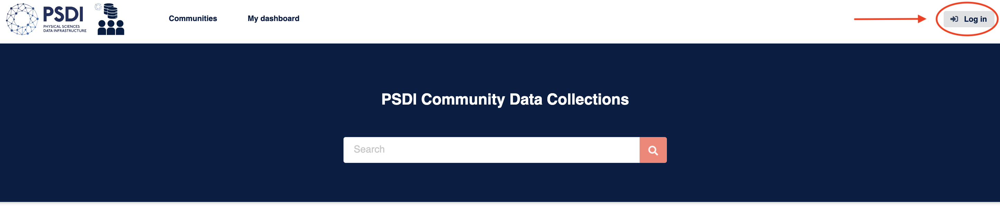
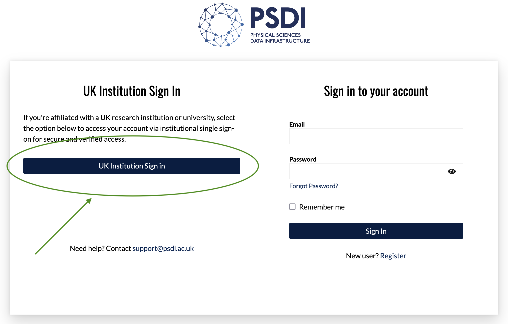
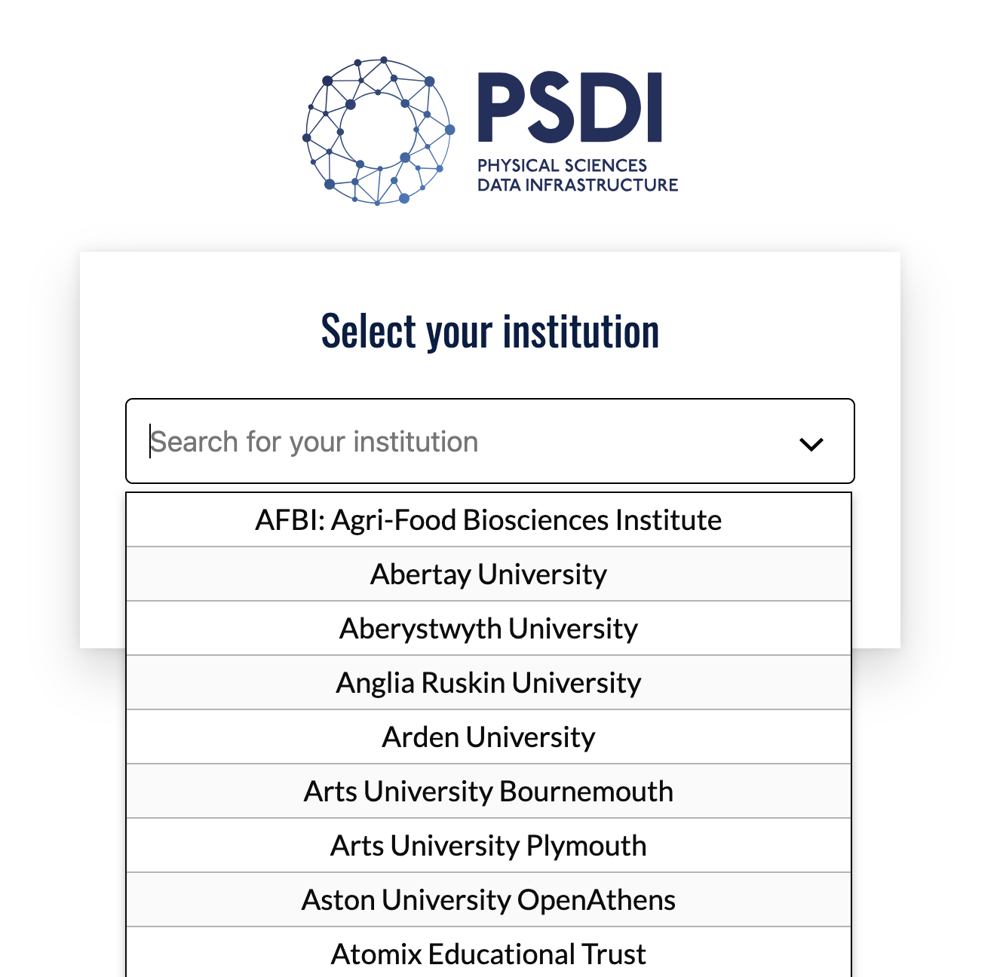
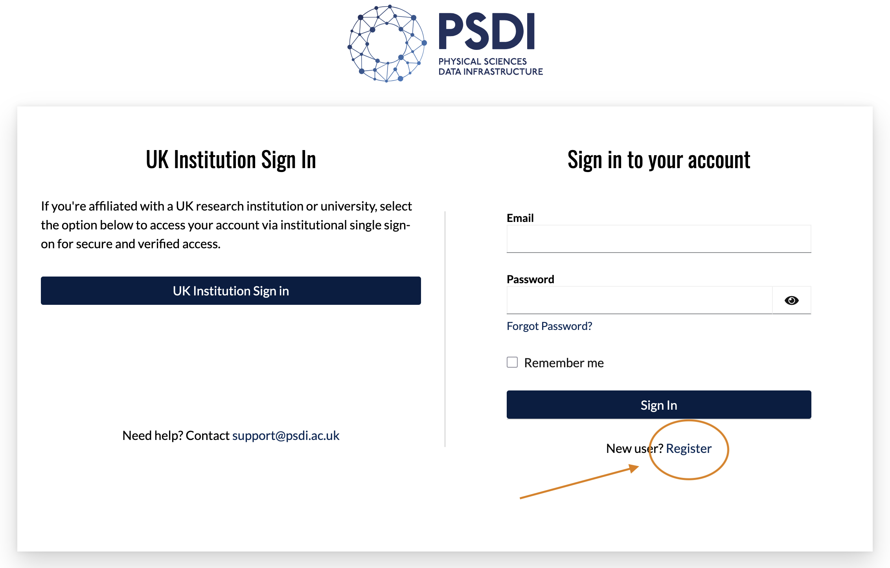
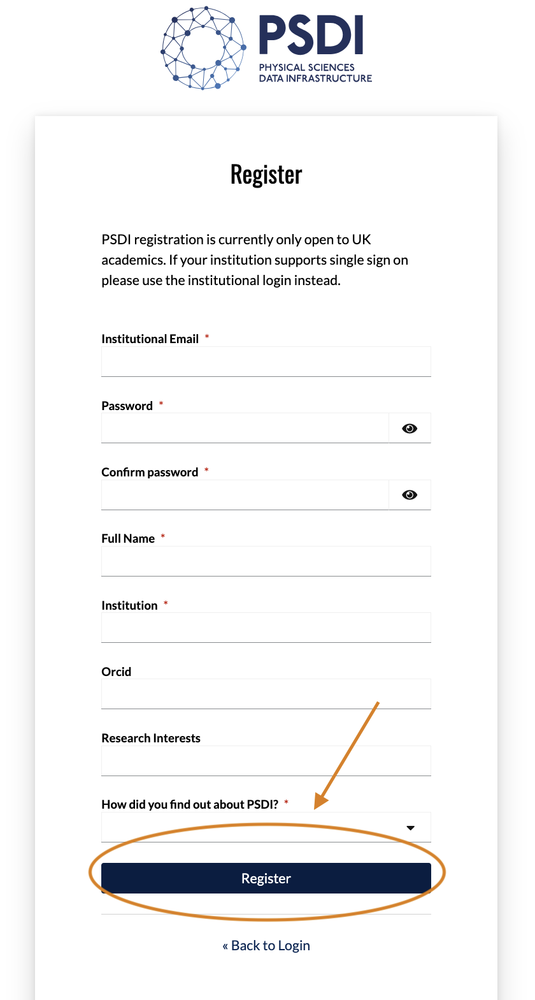
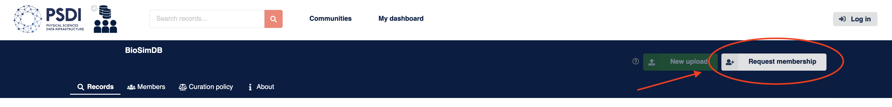
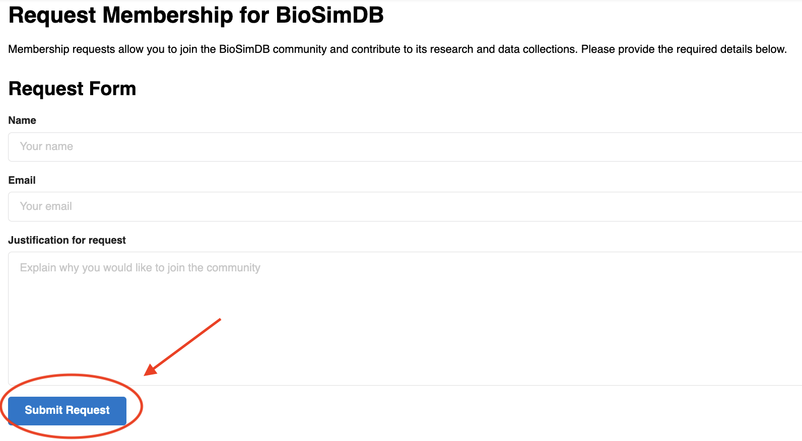

.. include:: ../.special.rst

1. Join the BioSimDB Community
==============================

To upload data to `BioSimDB <https://data-collections.psdi.ac.uk/communities/biosimdb/>`_, users must first join the BioSimDB community hosted by `PSDI <https://www.psdi.ac.uk/>`_ , by following the steps below.

a). PSDI Data Collection Login
------------------------------

Head to the `PSDI data collections website <https://data-collections.psdi.ac.uk/>`_ and click on the login button:

b). Account Creation
--------------------

There are two routes for creating a PSDI account, we strongly advise to use route (i). to avoid delays in creating your account. Where this is not possible, please follow option (ii).

b) (i). :sso:`SSO via Institution`
++++++++++++++++++++++++++++++++++

If you belong to a UK research institution, click on the "UK Institution Sign in" button to use SSO via your institution.
This is the quickest and preferred method for accessing PSDI Community Data Collections.

Find your UK research institution from the dropdown list, you will be redirected to your institution to login via your institutional credentials.

If step (i). has been successful for you, congratulations! Please skip step (ii). and move onto step c).

b) (ii). :manual:`Manual Registration`
++++++++++++++++++++++++++++++++++++++

.. note::
    Only register manually for an account if you do not find your institution listed. If your institution is listed and you have trouble logging in, please contact PSDI support directly instead of registering manually.

This step will require manual verification of your account, so please use an institutional email to avoid delays. As of writing these instructions, PSDI does not provide access to non-UK research institutions. If you do not have an institutional email address, please also consider contacting PSDI support directly with justification for your request, including "BioSimDB" in the subject of your email.

Fill in the short webform with your details and click register.

If successful, you will receive an email from PSDI, requesting confirmation of your account, to the email address you have manually registered with. Please note, this may take a few hours to be processed. If there are any further delays, please contact PSDI support directly.

c). BioSimDB Community Membership
---------------------------------

.. note::
    The process for joining the BioSimDB community may change and become more streamlined in the future. Please follow the steps below at present.

Once you have successfully logged into PSDI community data collections, you can request membership specifically to the `BioSimDB community <https://data-collections.psdi.ac.uk/communities/biosimdb/>`_.

We operate a permissive policy for accepting researchers who wish to share their data with the BioSim community and beyond. Please provide your name, email you used to log into PSDI and a (very) brief summary of what data you would like to upload to BioSimDB.

You will receive an email invitation from PSDI to join BioSimDB. Once you have accepted this email invitation, you will have access to submit your simulation data to BioSimDB!

Please next have a look at our guide on how to submit data to BioSimDB via the BiSimDB Interface.
