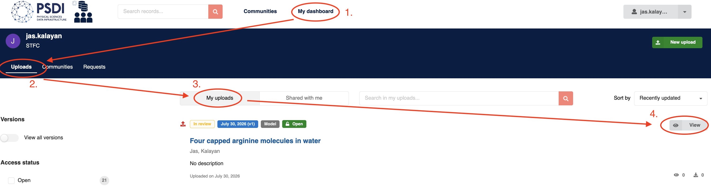
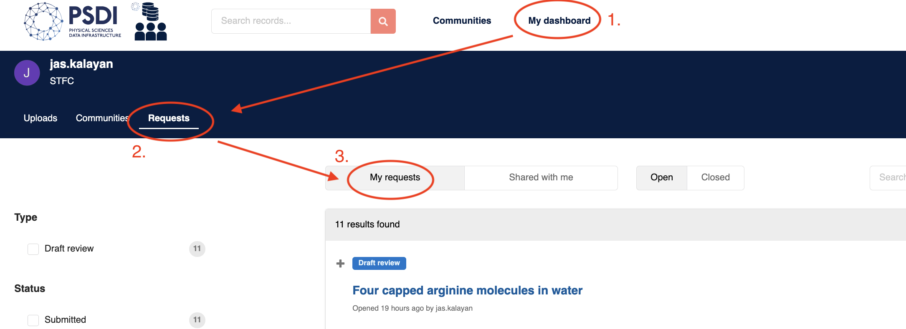
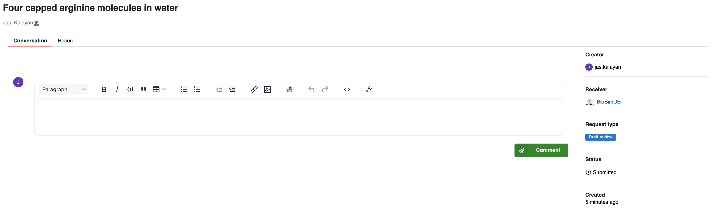

4. Record Review in BioSimDB
============================

Once you have submitted your simulation data record, it will be reviewed by a BioSimDB community curator.
You can find and view your submission status, when you're logged onto the  `PSDI data collections website <https://data-collections.psdi.ac.uk/>`_ in "My dashboard > Uploads > My uploads > View":

Review Considerations
---------------------

Each field in the submission form will be checked for validity. In the interest of transparency, further details on specific field checks are as follows:

- Simulation files - These will be checked to ensure they load via `MDAnalysis <https://www.mdanalysis.org/>`_.
- Metadata - The simulation metadata will be regenerated and compared with the submitted metadata. Any discrepancies in auto-generated fields will be highlighted and discussed.
- Title - Checked for relevance to the system composition and science.
- Description - Checked for the inclusion of scientific motivations and significant results from producing the trajectories.
- Related works - Confirmed with the submitter that any publications using the data are included.

We aim to keep the review process light-touch and as permissive as possible.

Review Format
-------------

The format of review will be an informal conversation between the submitter and reviewer, these conversations can be found in "My dashboard > Requests > My Requests"

When you click on a request, you will see a text box to add comments and replies in the review process, where applicable.

Once changes have been agreed, congratulations! Your submission will be published to BioSimDB and be accessible to everyone. Please share the link to your data and include in any publications, if applicable.
