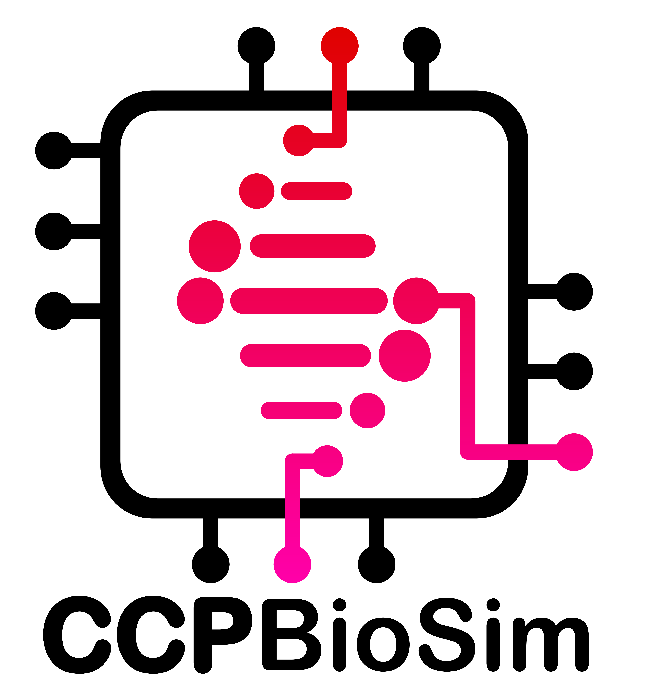

.. CCPBioSim-Python-Template documentation master file, created by
   sphinx-quickstart on Wed Dec 10 16:51:51 2025.
   You can adapt this file completely to your liking, but it should at least
   contain the root `toctree` directive.

BioSimDB Interface
==================

``biosimdb-interface`` is available at http://github.com/CCPBioSim/biosimdb-interface

.. image:: /_static/logos/biosimdb-logo-black.png
   :width: 250px
   :align: center
   :class: only-light

.. image:: /_static/logos/biosimdb-logo-white.png
   :width: 250px
   :align: center
   :class: only-dark

A web interface for extracting simulation metadata and uploading it to the
`BioSimDB <https://data-collections.psdi.ac.uk/communities/biosimdb>`_ community data collection,
hosted by PSDI.

.. toctree::
   :maxdepth: 2
   :caption: Contents:

   installation
   configuration
   oauth
   usage
   contributing
   api

Funding
=======

Contributors to biosim-schema were supported by

Indices and tables
------------------

* :ref:`genindex`
* :ref:`modindex`
